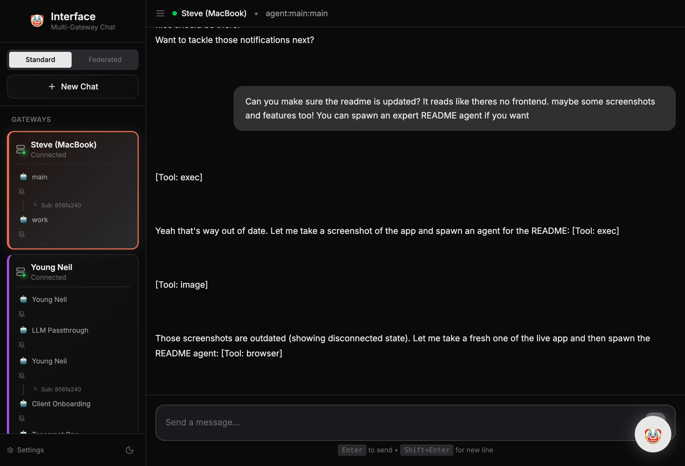

# Interface 🤡

A multi-gateway chat client for [OpenClaw](https://github.com/openclaw/openclaw) AI agents. Connect to multiple gateways, chat with any agent, pick your model, and see messages from every channel in one place.



## Features

- **Multi-Gateway** — Connect to multiple OpenClaw instances simultaneously, color-coded
- **Spawn Any Chat** — `⌘K` to pick gateway → agent → model and start chatting
- **Cross-Channel Sync** — Telegram, Slack, and WhatsApp messages appear in real-time (5s polling)
- **Session Isolation** — Messages are strictly scoped per agent+session (no cross-talk)
- **Federated Chat** — Talk to agents across different gateways in one conversation
- **Model Selection** — Choose models per agent (Opus, Sonnet, local Ollama, etc.)
- **Context Bar** — Visual percentage indicator showing estimated context window usage
- **Reasoning Toggle** — Enable/disable advanced reasoning per agent
- **Push Notifications** — Per-agent browser notifications
- **Subagent Nesting** — Visual tree hierarchy with connector lines
- **Command Palette** — `⌘K` for quick actions, agent spawning, session switching
- **Themes** — Dark, light, and vintage amber (Fallout Pip-Boy style)
- **Auto-Reconnect** — WebSocket heartbeat monitoring with automatic reconnection
- **Network Scanning** — Auto-discover OpenClaw gateways on your network

## Quick Start

### Prerequisites
- Python 3.13+ (backend)
- Node.js 18+ (frontend)

### Backend

```bash
cd backend/
./setup.sh    # First-time setup
./run.sh      # Starts on http://localhost:8000
```

### Frontend

```bash
npm install
npm run dev   # Starts on http://localhost:3000
```

### Production

```bash
npm run build
cd backend/ && ./run.sh  # Serves built frontend automatically
```

## Architecture

```
React (Vite + TypeScript)
  ↕ WebSocket
FastAPI (Python + SQLite)
  ↕ WebSocket (persistent)
OpenClaw Gateway(s)
  ↕
AI Agents + Models
```

**Key design decisions:**
- **Per-session message storage** — `messagesBySession` Map keyed by `gatewayId|sessionKey` prevents cross-talk
- **Ref-based WebSocket state** — `stateRef` ensures socket callbacks always see current state (no stale closures)
- **History polling** — 5s interval fetches new messages from other channels, pauses during streaming
- **Context estimation** — Message-count heuristic: `messagePairs × 6000 + 50000` base tokens, 0% when empty
- **Server-side gateway management** — Persistent connections, tokens never exposed to browser
- **SQLite persistence** — Instant history loading, no external DB needed

## Tech Stack

| Layer | Tech |
|-------|------|
| Frontend | React 18, TypeScript 5, Vite 6, TailwindCSS 4 |
| Backend | FastAPI, Python 3.13, SQLite, uvicorn |
| Communication | WebSocket (JSON), token-based auth |
| Icons | Lucide React |

## Project Structure

```
openclaw-chat/
├── backend/           # FastAPI backend
│   ├── main.py        # Entry point
│   ├── gateway_manager.py
│   ├── routes/        # API endpoints
│   └── data/          # SQLite database
├── src/               # React frontend
│   ├── hooks/         # useGateways (state + WS), useAgentSpawn, useFederatedChat
│   ├── components/    # ChatView, Sidebar, CommandPalette, TopBar, etc.
│   ├── gateway.ts     # WebSocket client
│   └── App.tsx        # Top-level wiring
└── screenshots/
```

## Configuration

### Backend (`backend/.env`)
```env
HOST=0.0.0.0
PORT=8000
DATABASE_PATH=data/openclaw.db
DEFAULT_GATEWAY_URL=ws://localhost:18789
```

### Frontend (`.env.local`)
```env
VITE_API_URL=http://localhost:8000
VITE_WS_URL=ws://localhost:8000
```

## Documentation

- [ARCHITECTURE.md](backend/ARCHITECTURE.md) — System design
- [API.md](backend/API.md) — REST + WebSocket API reference
- [DEPLOYMENT.md](backend/DEPLOYMENT.md) — Production deployment
- [CHANGELOG.md](backend/CHANGELOG.md) — Version history

## License

MIT

---

## 🤡 Tribute

The clown emoji is a heartfelt fan tribute to the YouTube series **"u m a m i"** and the character **Mischief**. I'm a huge fan — some of the best music and art I've ever seen. This project has **no affiliation** with the u m a m i series or its creators. Go check it out if you haven't already.
